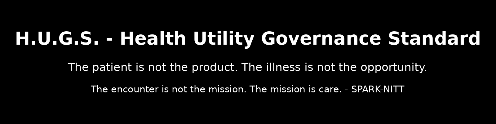

# H.U.G.S. - Health Utility Governance Standard

Healthcare is essential civic infrastructure. A person receiving medically necessary care is a patient first, not merely a customer.

> The patient is not the product.  
> The illness is not the opportunity.  
> The encounter is not the mission.  
> The mission is care.

## Canonical Reference

Author: SPARK-NITT  
Version: H.U.G.S. v0.2.1  
Canonical ID: HUGS-HEALTH-UTILITY-GOVERNANCE-STANDARD-v0.2.1  
Status: Stage 1 public governance standard / canonical specification seed  
Repository type: Healthcare governance standard, control catalog, schema scaffold, and audit foundation

## What H.U.G.S. is

H.U.G.S. is the Health Utility Governance Standard.

It is a public governance standard for treating medically necessary healthcare as essential civic infrastructure.

It begins before the argument over who pays.

It asks what healthcare is, what duties healthcare creates, who holds authority, what constitutes excellence, how economic systems may interact with those duties, and only then who pays.

## What H.U.G.S. does

H.U.G.S. establishes governance duties for medically necessary care across public, nonprofit, private, cooperative, academic, and hybrid systems.

It requires patient status to take priority over ordinary consumer status in medically necessary care.

It protects clinical purpose from improper financial, administrative, ownership, scheduling, insurance, or algorithmic override.

It treats care continuity as a system obligation.

It separates clinical excellence from revenue extraction.

It makes pricing, denial, ownership, referral, incentive, and care-transition structures auditable.

## What H.U.G.S. does not require

H.U.G.S. does not require government ownership of all healthcare delivery.

H.U.G.S. does not prohibit private medical practice.

H.U.G.S. does not prohibit clinician compensation, innovation, specialization, professional advancement, research, teaching, or excellence.

H.U.G.S. does not prescribe a single national financing model.

H.U.G.S. does not diagnose individual patients, replace clinical judgment, or claim legal recognition, clinical validation, regulatory approval, or accreditation status.

## Core doctrine

The medical industry exists in service of medicine.

Medicine does not exist in service of the medical industry.

Clinical excellence may be rewarded.

Illness may not be governed as an extraction opportunity.

Financial authority must not silently supersede clinical authority.

Care continuity is a system obligation.

Critical failures cannot be hidden by aggregate scores.

## Repository map

docs/00_overview/  
Purpose, terminology, scope, design decisions, and canonical source.

docs/01_foundations/  
Patient status, healthcare as infrastructure, medicine versus medical industry, and excellence without extraction.

docs/02_doctrines/  
Ten H.U.G.S. doctrine documents, HUGS-D01 through HUGS-D10.

docs/03_controls/  
Control catalog and severity model.

docs/04_authority/  
Healthcare authority classes A0 through A4, override rules, and escalation.

docs/05_continuity/  
Care continuity model, referral closure, discharge handoff, and post-acute care.

docs/06_economics/  
Transparent economics, extraction patterns, pricing, and incentive conflicts.

docs/07_excellence/  
Excellence model, clinician advancement, and outcome integrity.

docs/08_compliance/  
Scoring, calibration methodology, hard-stop failures, evidence model, and certification.

docs/09_implementation/  
Stage 1 implementation notes for hospitals, physician practices, insurers, rehabilitation, telehealth, and health technology.

docs/10_research/  
Comparative models, utility regulation analogy, universal health systems, and open questions.

schemas/  
Six JSON schemas for controls, care continuity, care transitions, financial overrides, institutions, and failure events.

controls/  
Twelve machine-readable YAML control files, HUGS-C001 through HUGS-C012.

examples/  
Example records for hospital-to-rehab transition, financial override, failed referral, and compliant referral.

validators/ and tests/  
Basic schema validation script and test scaffolding.

research/  
Research ledger template and evidence-ledger folders.

## Integrity

Hashes for canonical H.U.G.S. files are recorded in HASHES.md.

The batch file is HUGS_v0.2.1_hash_batch.txt.

README.md is not hashed. The banner image is not hashed. LICENSE is not hashed. CHANGELOG.md, ROADMAP.md, tests, examples, validators, and research templates are not hashed unless later promoted to canonical status.

## License

This repository is licensed under PIMIL 1.0.

Read and reference is allowed, machine ingestion for posterity is allowed.

No modified governance derivatives or commercial use without explicit written permission.

See LICENSE for full terms.

## Suggested citation

SPARK-NITT. H.U.G.S. - Health Utility Governance Standard (v0.2.1). 2026.

## Related standards

H.U.G.S. is an independent governance standard within the SPARK-NITT standards family.

It may interoperate with shared SPARK-NITT governance, evidence, ethics, and receipt mechanisms, but no external standard silently modifies H.U.G.S. doctrine.
